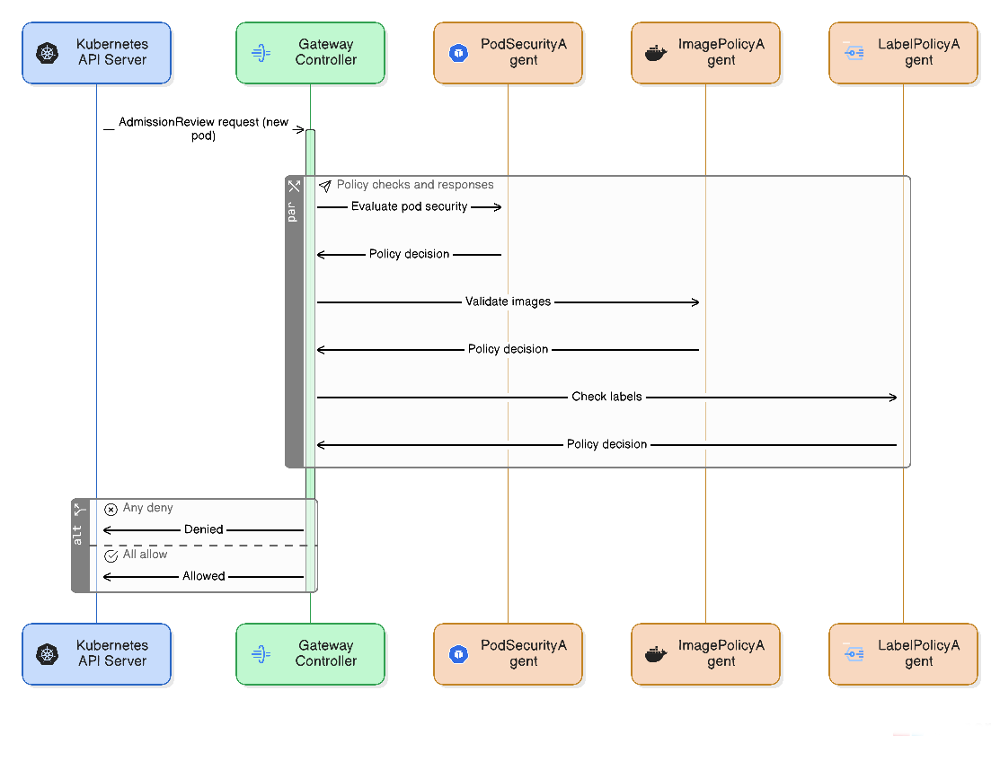

# Admeshion

<div align="center">

</div>

A small kubernetes admission controller that dispatches AdmissionReview requests to specialized agents for policy enforcement.

This was made for the sole purpose of learning how admission controllers work, if you want production ready admission controllers, please check out [Gatekeeper](https://github.com/open-policy-agent/gatekeeper) or [Kyverno](https://github.com/kyverno/kyverno).

I keep track of TODOs in the [TODO.md](TODO.md) file, feel free to contribute!

## Overview

The system consists of a gateway controller that receives AdmissionReview requests from the Kubernetes API server and dispatches them to registered agents. Each agent implements the `AdmissionAgent` interface and evaluates specific policies:

- **PodSecurityAgent**: Enforces pod security policies (privileged containers, hostPath, capabilities, etc.)
- **ImagePolicyAgent**: Validates container images against registry allowlists and security patterns
- **LabelPolicyAgent**: Enforces required labels and label value validation

The gateway aggregates agent decisions using fail-fast semantics, if any agent returns deny the request is rejected.

## Interface

```go
type AdmissionAgent interface {
    Name() string
    CanHandle(req admissionv1.AdmissionRequest) bool
    Handle(ctx context.Context, req admissionv1.AdmissionRequest) (AgentDecision, error)
}

type AgentDecision struct {
    Allowed bool   `json:"allowed"`
    Reason  string `json:"reason"`
    Code    int32  `json:"code"`
}
```

## Deployment

1. Generate TLS certificates:
```bash
./scripts/generate-certs.sh
```

2. Deploy the gateway:
```bash
kubectl apply -k deploy/kustomize/base/
```

3. Apply the ValidatingAdmissionWebhook:
```bash
kubectl apply -f deploy/webhook-config.yaml
```

## Configuration

Environment variables:
- `PORT`: HTTPS server port (default: 8443)
- `TIMEOUT`: Agent execution timeout (default: 10s)
- `MAX_PARALLEL`: Maximum concurrent agents (default: 10)
- `LOG_LEVEL`: Logging level (default: info)

The webhook is configured to intercept CREATE/UPDATE operations for pods, deployments, services, and other core resources, excluding system namespaces.

## Observability

Metrics available on port 8080:
- `admeshion_requests_total`: Total admission requests
- `admeshion_requests_rejected_total`: Rejected requests by reason
- `admeshion_agent_duration_seconds`: Per agent execution time
- `admeshion_agent_rejections_total`: Rejections by agent

## Local Testing

```bash
# Test metrics endpoint
kubectl port-forward svc/admeshion-gateway 8080:8080 -n admeshion-system
curl http://localhost:8080/metrics

# Test health endpoints
kubectl port-forward svc/admeshion-gateway 8443:443 -n admeshion-system
curl -k https://localhost:8443/health # Liveness probe
curl -k https://localhost:8443/ready # Readiness probe
```

## Running Binary Locally

```bash
# Build binary
go build -o bin/gateway ./cmd/gateway

# Generate local certs (required for HTTPS)
./scripts/generate-certs.sh
sudo mkdir -p /etc/certs
sudo cp certs/server.crt /etc/certs/tls.crt
sudo cp certs/server.key /etc/certs/tls.key

# Run locally
./bin/gateway
```

## References

https://kubernetes.io/docs/reference/access-authn-authz/admission-controllers/
https://pkg.go.dev/k8s.io/kubernetes/pkg/apis/admission
https://pkg.go.dev/k8s.io/apimachinery
https://pkg.go.dev/github.com/prometheus/client_golang/prometheus
https://pkg.go.dev/github.com/prometheus/client_golang/prometheus/promauto
https://pkg.go.dev/github.com/prometheus/client_golang/prometheus/promhttp
https://pkg.go.dev/go.uber.org/zap
https://pkg.go.dev/go.uber.org/zap/zapcore

## License

This project is licensed under the GNU General Public License v3.0, see the [LICENSE](LICENSE) file for details.
